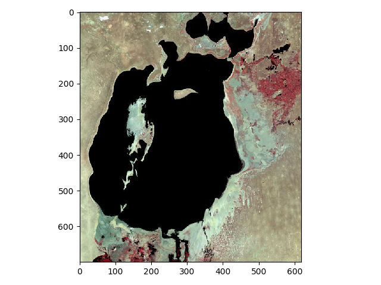
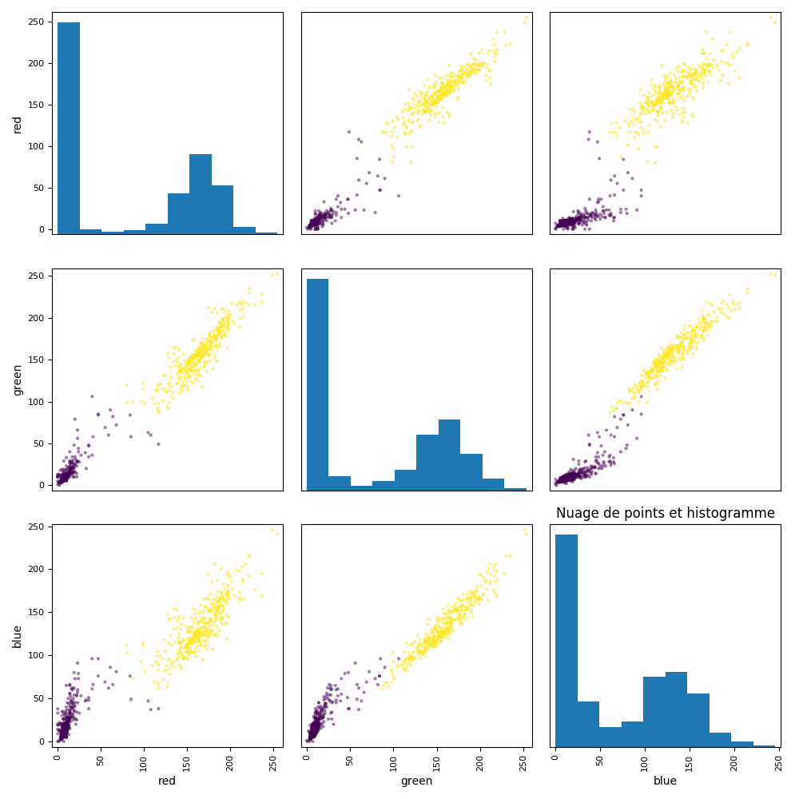

<table>
    <tr>
        <td>TALEC-BENARD Nicolas</br>
        	CALVEZ Tony</td>
<td>BE machine Learning (TP7)</td>
		<td>FIPA_2020 </br>26/11/2019</td>
</table>


# 🐚 - Classification d'images satellites de la mer d'Aral 

------

## 1 - Examen des données, pré-traitements et extraction des descripteurs:

### Question 1:

*Compléter une fonction preprocessing() permettant de charger les deux images et de les afficher.* *indication : loadImages().*


Fonction `preprocessing()`:

```python
#%% def preprocessing
def preprocessing():
    # ------------------------------------------------
    # YOUR CODE HERE
    img73, img87 = loadImages()
    featLearn = 0

    # Redimensionnement
    img73 = img73[120:820, 180:800, :]
    img87 = img87[120:820, 180:800, :]

    # Affichage des images
    plt.figure(1);
    plt.imshow(img73);
    plt.show()

    plt.figure(2);
    plt.imshow(img87);
    plt.show()
    # ------------------------------------------------
    # ------------------------------------------------
    #%% sortie
    return featLearn,img73,img87
    
```

### Question 2: 

*Que peut-on deduire de l’analyse de ces images ? Comment sont codees les valeurs des pixels ?*

Ces images sont codees en RGB


### Question 3: 

*Les images sont en couleurs et nous allons utiliser les composantes des couleurs comme descripteurs de classification. Quelle est la dimension de l’espace des descripteurs lorsque l’image est codee en RGB (RVB) ?*

L’espaces des descripteurs est de dimension 3 soit une dimension par couleur codés sur 8
bits (de 0 à 255).


### Question 4: 

*Tronquer de la meme maniere les deux images pour faire disparaıtre le texte dans la partie haute et basse des images:*

​																					**Img73:**

| Avant                                                        | Apres                           |
| ------------------------------------------------------------ | ------------------------------- |
|  |  |

​																					**Img87:**

| Avant                                                        | Apres                           |
| ------------------------------------------------------------ | ------------------------------- |
|  |  |

------


## 2 - Constitution d'un ensemble de donnees d'apprentissage

------

### Question 5: 

*Completer la fonction preprocessing() par une partie qui vise a constituer une base d’apprentissage. Pour cela, realisez un sous-echantillonnage de l’image de 1973 avec un pas de 500 points (indication : selectFeatureVectors.py). Quel est le nombre de donnees d’apprentissage ?*

Fonction `preprocessing()`:

```python
#%% def preprocessing
def preprocessing():
    # ------------------------------------------------
    # YOUR CODE HERE
    img73, img87 = loadImages()
    featLearn = 0

    # Redimensionnement
    img73 = img73[120:820, 180:800, :]
    img87 = img87[120:820, 180:800, :]

    # Affichage des images
    plt.figure(1);
    plt.imshow(img73);
    plt.show()

    plt.figure(2);
    plt.imshow(img87);
    plt.show()
    
    # Echantillonnage
    featLearn, nbPix, nbFeat = selectFeatureVectors(img73, 500)
    print('nb pix:', nbPix, '\r')
    print('nb feat:', nbFeat, '\r')
    # print('featLearn:', featLearn, '\r')

    # ------------------------------------------------
    # ------------------------------------------------
    #%% sortie
    return featLearn,img73,img87
```

> Output:
>
> ```
> nb pix: 868 
> nb feat: 3 
> ```


Nous avons donc ici pour l'image de 1973 un nombre de données d’apprentissage egal a un tableau de dimension (868,3).


## 3 - Premiere analyse des donnees

### Question 6:

*Dans preprocessing, visualiser en 2D et 3D les valeurs des descripteurs. La visualisation en 2D des vecteurs d’apprentissage se fait par la fonction displayFeatures2d(feat) et en 3D displayFeatures3d(feat).*

Fonction `preprocessing()`:

```python
#%% def preprocessing
def preprocessing():
    # ------------------------------------------------
    # YOUR CODE HERE
    img73, img87 = loadImages()
    featLearn = 0

    # Redimensionnement
    img73 = img73[120:820, 180:800, :]
    img87 = img87[120:820, 180:800, :]

    # Affichage des images
    plt.figure(1);
    plt.imshow(img73);
    plt.show()

    plt.figure(2);
    plt.imshow(img87);
    plt.show()

    # Echantillonnage
    featLearn, nbPix, nbFeat = selectFeatureVectors(img73, 500)
    print('nb pix:', nbPix, '\r')
    print('nb feat:', nbFeat, '\r')
    # print('featLearn:', featLearn, '\r')

    # Affichage 2D et 3D
    displayFeatures2d(featLearn)
    displayFeatures3d(featLearn)

    # ------------------------------------------------
    # ------------------------------------------------
    #%% sortie
    return featLearn,img73,img87
```

> Output:
>
> | displayFeature2D                                             | displayFeature3D                              |
> | ------------------------------------------------------------ | --------------------------------------------- |
> |  |  |


### Question 7:

*Decrivez explicitement ces graphiques en expliquant ce qu’ils representent, en donnant leurs caracteristiques pour les histogrammes et les nuages de points (differents groupes ? a quelles informations peut-on les relier ?)*

<u>**displayFeatures2d:**</u>

Ce graphique nous montre à la fois les valeurs des pixels par couleur dans l’image et leur repartition dans l’image. Les histogrammes montre la valeur du pixel correspodnant au point sur le nuages de point de chaque couleur.

<u>**displayFeatures3d:**</u>

Ici nous avons un nuage de points correspondant aux 3 niveaux RBG, ces niveaux sont representes dans le meme graphique ce qui nous permet de penser que la couleure du lac se situe en bas a gauche de ce graphique, dans les niveaux les plus sombres,


## 4 - approche non supervisee par la methode des k-means

### Question 8:

*Decrire la methode des centres mobiles*:

La methode des centres mobiles sert a partitionner en différentes classes des individus pour lesquels on dispose de mesures ou de valeurs. Ces individus sont représentés comme des points de l’espace ayant pour coordonnées ces valeurs. On cherche à regrouper autant que possible les individus les plus semblables (du point de vue des valeurs que l’on possède) tout en séparant les classes le mieux possible les unes des autres.

La méthode des centres mobiles s’applique lorsque l’on sait à l’avance combien de classes on veut obtenir. Pour initialiser l’algorithme, on tire au hasard autant d’individus que de classes souhaités appartenant à la population, ce sont les centres initiaux. 

Ensuite, On répartit l’ensemble des individus dans les classes en regroupant autour de chaque centre l’ensemble des individus qui sont plus proches du centre que des autres centres. Puis on détermine les centres de gravité des classes ainsi obtenues et on désigne ces points comme les nouveaux centres.

On répète ces deux étapes jusqu’à la stabilisation de l’algorithme, c’est-à-dire jusqu’à ce que le
découpage en classes obtenu ne soit presque plus modifié par une itération suplémentaire.


### Question 9: 

*Appeler et completer le script `unsupervisedTraining.py` qui permet realiser un apprentissage non supervise du modele de classement (classifieur) a l’aide de la fonction KMeans() du package scikit learn (puissant package de Machine Learning pour python). Comment utilise-t-on cette fonction ? Quels en sont les parametres de controle importants ?*


Contenu du script python `unsupervisedTraining.py` :

```python
# %% def unsupervisedTraining
def unsupervisedTraining(featLearn, method='kmeans'):
    ''' apprentissage avec la fonction KMeans() et GaussianMixture 
    de scikit-learn :
    - featLearn est la matrice de l'ensemble d'apprentissage
    - method: type d'algorithme de Machine Learning utilisé (KMeans et GaussianMixture) 
    - nbCluster est le nombre de cluster = nombre de classes rentré par l'utilisateur en début de fonction
    - renvoie model: le modèle de classement ou classifieur
    '''

    # fixer le nombre de classes
    answer = input('nombre de classes:')
    nbCluster = int(answer)

    if method == 'kmeans':
        init = 'random'
        n_init = 10
        max_iter = 300

        model = KMeans(nbCluster, init, n_init, max_iter).fit(featLearn)

    elif method == 'gmm':
        pass
    # ------------------------------------------------
    # YOUR CODE HERE
    # ------------------------------------------------
    # ------------------------------------------------
    # sortie
    return model
```


la fonction `Kmeans()` prend en argument le nombre de classes (nbCluster), la méthode du choix des centres initiaux (ici nous utilisons un choix aléatoire) et le nombre maximum d’itérations effectuer par la fonction pour converger.


### Question 10: 

*Completer `aralsea_main.py` pour predire les labels sur la base d’apprentissage grace au modele appris.*

Implementation dans `aralsea_main.py` :

```python
# %% Apprentissage / Learning / Training

# Apprentissage de la fonction de classement
# ------------------------------------------------
model = unsupervisedTraining(featLearn, 'kmeans')
# ------------------------------------------------

# prediction des labels sur la base d'apprentissage
# ------------------------------------------------
labels = model.labels_
# ------------------------------------------------
```


### Question 11:

*Il est maintenant possible de visualiser les valeurs des descripteurs d’apprentissage et leur appartenance a l’une des classes (un des clusters). Nous utiliserons la fonction : `displayFeatures2d` et `displayFeatures3d`. Completer `aralsea_main.py`. Faire varier le parametrage de la fonction KMeans et analyser les differences et la qualite de l’apprentissage.*

Implementation dans `aralsea_main.py` :

```python
# Visualisation des resultats
# ------------------------------------------------
displayFeatures2d(featLearn, labels)
displayFeatures3d(featLearn, labels)
# ------------------------------------------------
```

> Output:
>
> | displayFeature2D                                             | displayFeature3D                                             |
> | ------------------------------------------------------------ | ------------------------------------------------------------ |
> |  |  |


**<u>Variation des parametres de Kmeans :</u>**

* NbClusters : Lorsqu’on augmente le nombres de classes, on augmente le nombres de couleurs sur le graphique mais pour notre application, le nombres de 2 est suffisant.

* Le nombre d’essai pour une valeur de 1, a pour effet de retourner des valeurs erronées quand les centroides initiaux sont mauvais.
* Le nombre d’itérations à pour effet de laisser de définir de mauvaises limites entres les classes quand il est trop petit.


### Question 12: 

*A ce stade, vous avez choisi les hyper-parametres de vos methodes de machine learning et obtenu le modele de classement, nous pouvons alors utiliser les donnees d’apprentissage pour classifier l’ensemble des deux images. Il faut calculer les descripteurs sur toute l’image (mise sous la forme d’une matrice) puis utiliser le modele de classement issu de l’apprentissage du k-means). Completer les scripts `aralsea_main.py` et `unsupervisedClassifying.py`.*

Script python `unsupervisedClassifying.py`:

```python
# %% def unsupervisedClassifying
def unsupervisedClassifying(model, feat):
    ''' classement/prédiction à partir d'un modèle de classement non supervisé
    feat est la matrice du jeu de données à classer
    label est la classe prédite
    '''
    # ------------------------------------------------
    label = model.predict(feat)
    # ------------------------------------------------
    return label
```


Implementation dans `aralsea_main.py`:

```python
# %% Classement et estimation de la diminution de surface
# Classifying / Predicting / Testing

# mise en forme de l'image de 1973 et 1987 en matrice Num Pixels / Val Pixels
# ------------------------------------------------
n_img73 = np.zeros([img73.shape[0] * img73.shape[1], 3])
for i in range(0, 2):
    n_img73[:, i] = img73[:, :, i].flatten()
#print(n_img73)

n_img87 = np.zeros([img87.shape[0] * img87.shape[1], 3])
for i in range(0, 2):
    n_img87[:, i] = img87[:, :, i].flatten()
#print(n_img73)
# ------------------------------------------------
```


### Question 13: 

*Pour visualiser le resultat de classification, il faut que chaque classe predite puisse etre affectee au pixel correspondant de l’image. Cette image est calculee et visualisee par la fonction `displayImageLabel.py`. Completer `aralsea_main.py`*

Implementation de `displayImageLabel()` dans `aralsea_main.py`:

```python
# Classement des deux jeux de données et visualisation des résultats en image
# ------------------------------------------------
label_img73 = unsupervisedClassifying(model, n_img73)
label_img87 = unsupervisedClassifying(model, n_img87)

displayImageLabel(label_img73, img73)
displayImageLabel(label_img87, img87)
# ------------------------------------------------
```

> Output:
>
> | img 1973                                                     | img 1987                                                     |
> | ------------------------------------------------------------ | ------------------------------------------------------------ |
> |  |  |


### Question 14:

*Apres avoir identifiee sur l’image la couleur de la classe (et son numero) de la zone correspondant a la mer d’Aral, il est possible d’en estimer la surface (i.e. le nombre de pixels) sur les deux images et d’en estimer l’evolution. Quelle est approximativement cette evolution en % ? Pour repondre a cette question completer `aralsea_main.py.`*

Calcul de l'evolution de la surface dans `aralsea_main.py`:

```python
# %% Estimation de la surface perdue
answer = input('Numero de la classe de la mer ? ')
cl_mer = int(answer)
# ------------------------------------------------
surface_73 = 0
for i in label_img73:
    if i == cl_mer:
        surface_73 += 1
print('surface en pixels de la classe: ', surface_73)

surface_87 = 0
for i in label_img87:
    if i == cl_mer:
        surface_87 += 1
print('surface en pixels de la classe: ', surface_87)

evo_surface = (1-surface_87/surface_73)*100
print('evolution de la surface: ', evo_surface, "%")
# ------------------------------------------------
```

Ici nous calculons le nombre de pixels de la classe representant le lac entre 1973 et 1987, puis nous en deduisons l'évolution de la surface. Elle est approximativement de 20.97 %.


### Question 15: 

*Analyser en fonction des parametres du kmeans et du mode de codage des couleurs la creation de classe dans l’espace des descripteurs et donner l’impact que cela a sur le pourcentage estime ?*

Si nous considerons 3 classes, l’evolution de la mer est de 23,64 %.

Si nous considerons 4 classes, l’evolution de la mer est de 25.25 %.

Lorsque les paramètres de la fonction Kmeans évoluent, le résultat final évolu aussi, la définiton du nombres de classes est le point le plus important de la fonction, c’est le paramètre qui a le plus d’impact sur le résultat.


## 4 - Approche non-supervisee par GMM

### Question 16:

*Decrire en detail, l’apprentissage du classifieur non supervise base sur les melanges de gaussiennes.*

Les données sont générées à partir d’échantillons provenant de K différentes lois gaussiennes, ayant chacune des moyennes et des covariances différentes.


### Question 17:

*Completer votre code pour apprendre un classifieur base des melanges de gaussiennes.*


TALEC-BERNARD Nicolas - CALVEZ Tony

FIPA2020